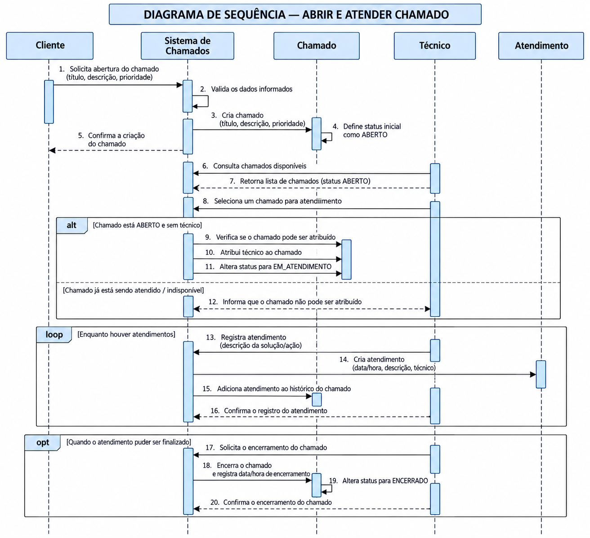

# Controle de Chamados

Projeto desenvolvido para representar o funcionamento de um sistema de gerenciamento de chamados utilizando conceitos de Programação Orientada a Objetos.

## Funcionalidades

O sistema permite:

- Criar um chamado com status inicial `ABERTO`;
- Atribuir um técnico ao chamado;
- Alterar o status para `EM_ATENDIMENTO`;
- Impedir que outro técnico assuma um chamado que já está em atendimento;
- Registrar múltiplos atendimentos no histórico do chamado;
- Registrar data e hora dos atendimentos;
- Encerrar o chamado quando as condições necessárias forem atendidas;
- Alterar o status do chamado para `ENCERRADO`.

## Diagrama de Sequência

O diagrama abaixo representa o fluxo de abertura, atribuição, atendimento e encerramento de um chamado.

## Tecnologias utilizadas

- Java
- Apache NetBeans
- Git
- GitHub
- UML
